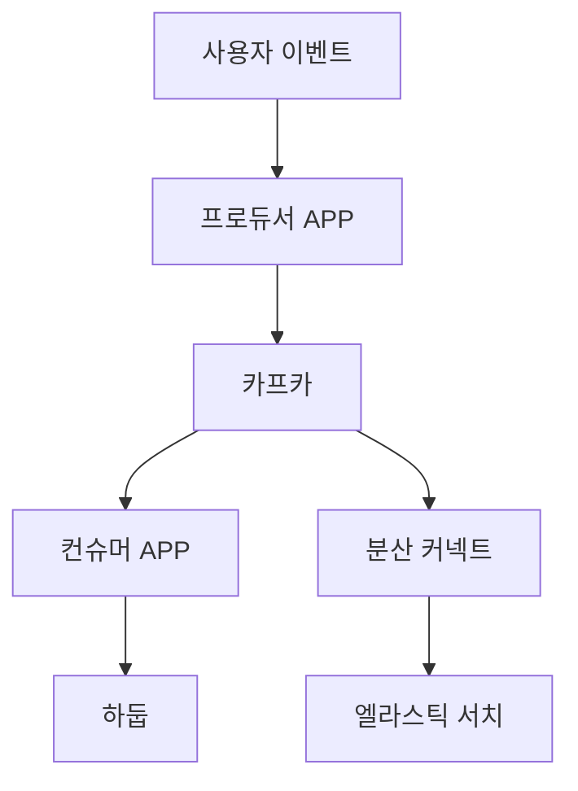

# 아파치 카프카 with 자바 Ch5. 카프카 실전 프로젝트
웹 페이지의 이벤트 적재 파이프라인을 만들어보자.

## 요구사항
이름을 입력하고 자신이 좋아하는 색상을 고르는 버튼을 누르면 이에 대한 이벤트 정보를 카프카 토픽으로 전달하고 최종적으로 하둡과 엘라스틱에 적재하는 것을 목표로 한다.
- 하둡: 대용량 데이터 분석 처리 시스템
- 엘라스틱서치: 오픈소스 분산 검색 엔진, 데이터를 쌓아 방대한 양의 데이터를 저장, 검색, 분석할 때 사용

 

### 파이프라인 정책
- 일부 데이터의 유실 또는 중복 허용
- 안정적으로 끊임없는 적재
- 갑작스럽게 발생하는 많은 데이터양 허용

 

### 아키텍처

<

## 개발 순서
1. 로컬 하둡, 엘라스틱서치, 키바나 설치
2. [웹페이지 개발](https://github.com/dsc-sookmyung/2023-winter-sstudy/blob/raae7742/week7/producer/src/main/resources/static/favorite-color-webpage.html)
3. [프로듀서 개발](https://github.com/dsc-sookmyung/2023-winter-sstudy/tree/raae7742/week7/producer): 버튼을 클릭했을 때 전달받는 사용자 데이터를 토픽으로 전송
4. [하둡 적재 컨슈머 개발](https://github.com/dsc-sookmyung/2023-winter-sstudy/tree/raae7742/week7/consumer)
5. [엘라스틱서치 싱크 커넥터 개발](https://github.com/dsc-sookmyung/2023-winter-sstudy/tree/raae7742/week7/elastic-connector)
